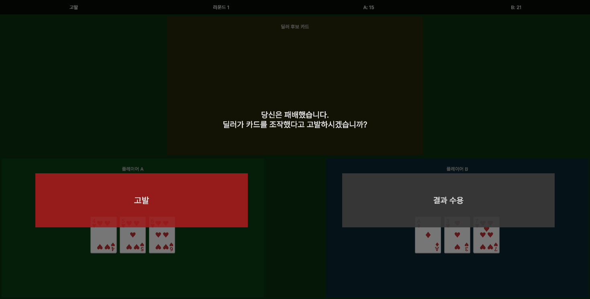
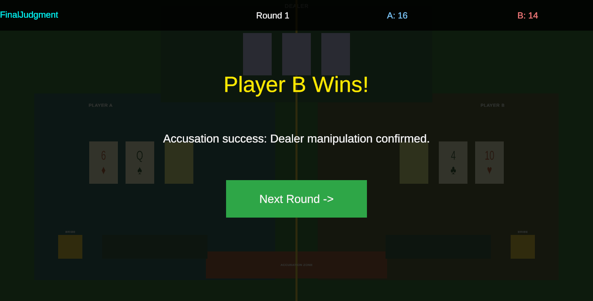

# 🦁🃏 ZooJack

> **딜러에게 뇌물을 건네 카드를 조작하고, 속임수를 눈치챈 상대는 고발로 승패를 뒤집는 3인 심리전 카드 게임**


🎮 **플레이** : [boxonkr.itch.io/zoo-jack](https://boxonkr.itch.io/zoo-jack)  
📦 **팀 저장소** : [github.com/zouea4879/Zoo-Jack](https://github.com/zouea4879/Zoo-Jack)  
📁 **이 저장소** : 제가 담당한 시스템 코드만 모아 둔 포트폴리오용 저장소입니다.

<p align="center">
  
  
  <br/><sub>⚖️ 패자의 고발 선택 → 고발 성공 시 승패 역전 (개발 초기 프로토타입 화면)</sub>
</p>

---

## 📌 프로젝트 개요

| | |
|---|---|
| 🎲 **장르** | 카드 게임 · 전략 (블랙잭 기반 블러핑) |
| 🛠️ **엔진 / 언어** | Unity / C# |
| 🌐 **네트워크** | Photon Fusion 멀티플레이 |
| 👥 **팀 구성** | 2인 (클라이언트 프로그래머) |
| 📅 **개발 기간** | 2026.06 ~ 2026.09 (약 3개월) |
| 🚀 **출시** | itch.io · 2026.08.22 |

---

## 🕹️ 게임 흐름

```
🃏 카드 분배 → 💰 딜러에게 뇌물 → 🎭 딜러의 카드 조작 → ✋ Hit / Stand
      → 🏁 결과 공개 → ⚖️ 패자의 고발 → 👑 최종 판정 (승패 역전 or 유지)
```

---

## ⭐ 핵심 구현

### ⚖️ 고발 시스템 — `Gameplay/Round/`
- 🕵️ 라운드 중 딜러의 카드 조작을 **기록** (`ManipulationRecordTracker`)
- 🙋 패배한 플레이어가 조작을 의심하면 **고발** 선택
- ✅ 조작이 있었으면 고발 성공 → **승패 역전** / ❌ 없었으면 패배 유지 (`AccusationJudge`)
- 🧮 블랙잭 점수·결과 계산과 정산을 **순수 C# 로직**으로 분리 (`RoundEngine`, `RoundSettlement`)

### 🌐 Photon 멀티플레이 — `Multiplayer/`
- 🚪 방 생성 · 입장 · 캐릭터 선택 로비 (`NetworkLobbyManager`)
- 🔄 페이즈 · 턴 · 카드 · 준비 상태를 `[Networked]` 상태로 **모든 플레이어 화면에 동기화** (`FusionGameState`)
- 💬 채팅 · 감정 표현 · 뇌물 · 최종 판정 데이터 공유

### 🎨 UI · 연출 — `Gameplay/View/`
- 🃏 카드 공개 시퀀스, 판정 서스펜스, 최종 랭킹 보드
- 😀 감정 휠 · 말풍선, 🪙 베팅 칩, ⏳ 턴 타이머, 📜 히스토리 패널

### 🧰 에디터 툴 — `Editor/`
- ⚙️ 씬 UI를 코드로 자동 구성하는 **Setup Tool** 20여 종
- 🌏 텍스트 카탈로그 · 워크벤치로 게임 내 문구를 한곳에서 관리

---

## 🔧 트러블슈팅 — GameDirector 리팩터링

| | |
|---|---|
| ❗ **문제** | 모든 기능이 `GameDirector` 한 클래스에 몰려 인스펙터에서 값 찾기·수정이 점점 어려워짐 |
| 🔍 **원인** | 단일 클래스에 책임 과집중 + 하드코딩된 값 → 유지보수성 저하 |
| 🛠️ **해결** | 역할별로 **4개 클래스로 분리**, 하드코딩 제거 |
| 🎯 **결과** | 기능 위치가 명확해져 수정·디버깅이 쉬워짐 |

> 💡 **"동작하는 코드"와 "유지보수되는 코드"의 차이를 체감한 경험**

---

## 📂 폴더 구조

```
📁 Editor/        🧰 씬 자동 구성 · 텍스트 관리 에디터 툴
📁 Gameplay/
 ├─ Round/        ⚖️ 블랙잭 · 조작 기록 · 고발 판정 · 정산
 ├─ Core/         🧩 역할 배정 · 좌석 · 공용 데이터 모델
 ├─ View/         🎨 UI · 연출 · GameDirector
 ├─ Avatar/       🐾 캐릭터 이동 · 애니메이션
 ├─ Chat/ Emotion/ 💬 채팅 · 감정 표현
 └─ Audio/ Settings/ Text/
📁 Multiplayer/   🌐 Photon Fusion 로비 · 게임 상태 동기화
📁 Screenshots/   🖼️ 플레이 화면
```

---

👤 **박성희** · Unity Client Programmer
